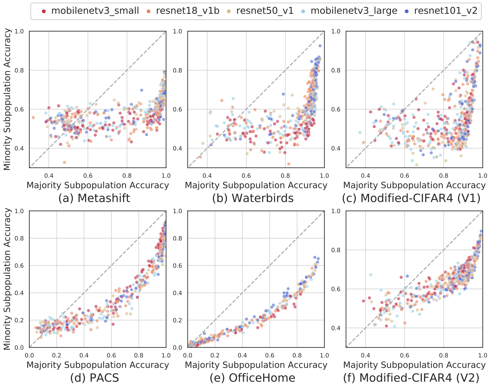

# On the nonlinear correlation of ML performance between data subpopulations（ICML 2023)

[](https://moonshape.readthedocs.io)
[](https://lbesson.mit-license.org/)
[](https://openreview.net/forum?id=oRkZj3Bju2)
[](https://www.python.org/downloads/release/python-360/)
[](https://shields.io/)
[](https://jupyter.org/try)

This repo provides the PyTorch source code of our paper: 
> [On the nonlinear correlation of ML performance between data subpopulations](https://openreview.net/forum?id=oRkZj3Bju2) <br>
> Weixin Liang*, Yining Mao*, Yongchan Kwon*, Xinyu Yang, James Zou  <br> 
> ICML (2023) [[Arxiv]](https://arxiv.org/pdf/2305.02995.pdf)


# Overview
TL;DR: We show that there is a “moon shape” correlation (parabolic uptrend curve) between the test performance on the majority subpopulation and the minority subpopulation. This nonlinear correlations hold across model architectures, training settings, datasets, and the imbalance between subpopulations.

## Introduction
Subpopulation shift is a major challenge in ML: test data often have different distribution across subgroups (e.g. different types of users or patients) compared to the training data. Recent works find a strong linear relationship between ID and OOD performance on dataset reconstruction shifts; In contrast, we empirically show that they have a nonlinear correlation under subpopulation shifts.

## What is the moonshape phenomenon?



## Why is it not obvious?

See our [paper](https://arxiv.org/pdf/2305.02995.pdf) for details!

# Get Started

## Requirements
Our implementation framework is based on [MXNet](https://mxnet.apache.org/) and [AutoGluon](https://auto.gluon.ai/stable/index.html).
- mxnet >= 1.7.0
- pytorch >= 1.10.1
- torchvision >= 0.11.2
- autogluon
- gluoncv

## Datasets
We implement 5 subpopulation shift datasets with 6 settings (2 versions for Modified-CIFAR4). 
- Spurious correlation datasets: MetaShift, Waterbirds, Modified-CIFAR4 V1
- Rare subpopulation datasets: PACS, OfficeHome, Modified-CIFAR4 V2

#### Download the data
- For MetaShift [[GoogleDrive]](https://drive.google.com/file/d/1P2kvXa_erLVHBqL_0RDe5HLmpnA1rz2I/view?usp=sharing), PACS [[GoogleDrive]](https://drive.google.com/uc?id=1JFr8f805nMUelQWWmfnJR3y4_SYoN5Pd), OfficeHome [[GoogleDrive]](https://drive.google.com/file/d/0B81rNlvomiwed0V1YUxQdC1uOTg/view?usp=sharing&resourcekey=0-2SNWq0CDAuWOBRRBL7ZZsw), data needs to be downloaded to corresponding dataset folders in `datasets/`;
- For Waterbirds, install [WILDS](https://wilds.stanford.edu/datasets/) using pip: `pip install wilds` and download data with code;
- For Modified-CIFAR4, CIFAR10 dataset will first be downloaded with torchvision.

#### Prepare the data
- To see the dataset samples and prepare the data, run the jupyter notebook in corresponding dataset folder in `datasets/`. For example, Metashift dataset preparation code is in `datasets/metashift/metashift_prepare.ipynb`.
- In each dataset preparation notebook, you can change the `ROOT_PATH` and `EXP_ROOT_PATH` in the first code cell. 
    - `ROOT_PATH`: downloaded dataset root path
    - `EXP_ROOT_PATH`: experiment root path, default to `experiments/DATASET_NAME`
- The prepared data will be saved in `EXP_ROOT_PATH/data` in [Pytorch Image Folder](https://pytorch.org/vision/main/generated/torchvision.datasets.ImageFolder.html) Format:
    - Training data in `EXP_ROOT_PATH/data/train`;
    - Validation data in `EXP_ROOT_PATH/data/majority-val` and `EXP_ROOT_PATH/data/minority-val`.

## Training Process
Train 500 different ML models with varying configurations following the search space of [AutoGluon](https://auto.gluon.ai/stable/index.html).
Here for each dataset, we implement with 5 model architectures, 5 learning rates, 5 batch sizes, and 4 training durations:
```python
@ag.args( # 5 models * 5 lr * 5 batch_size * 4 epochs = 500 configurations
    model = ag.space.Categorical(
        'mobilenetv3_small', 
        'resnet18_v1b', 
        'resnet50_v1', 
        'mobilenetv3_large', 
        'resnet101_v2', 
        ),
    lr = ag.space.Categorical(0.01, 0.005, 0.001, 0.0005, 0.0001), 
    batch_size = ag.space.Categorical(8, 16, 32, 64, 128), 
    epochs = ag.space.Categorical(1, 5, 10, 25)
    )
```

Specify the experiment directory, and you can train the models.

For example, if you prepare and save the data in `experiments/metashift/data`, run:
```bash
python main.py --exp-dir experiments/metashift
```
and you will get the following results in `experiments/metashift/result`:
- A table with evaluation results of each configuration,
- A 'majority subpopulation accuracy vs. minority subpopulation accuracy' plot corresponding to the table.

# Reference

If you found this code/work to be useful in your own research, please considering citing the following:

```
@inproceedings{liang2022nonlinear,
  title={On the nonlinear correlation of ML performance betweem data subpopulations},
  author={Liang, Weixin and Mao, Yining and Kwon, Yongchan and Yang, Xinyu and Zou, James},
  booktitle={ICML},
  year={2023}
}
```
